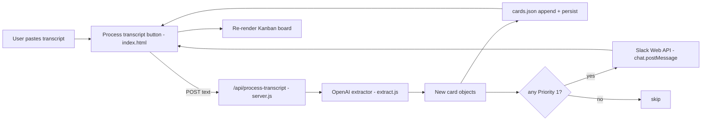

# Kanban Transcript Automation — Project Plan

_Generated from the plan agreed in Plan mode (Session 3, Step 4 of the handout). This file is the source of truth for the rest of Session 3 — update the checkboxes below after each step._

## Status checklist

- [x] **Step 5 — Slack MCP configured and test message verified** — posted "Cursor MCP connection confirmed." to `#disney-cursor-webinar` (`C0AU1C0UA0M`) on 2026-04-20 via `slack_post_message` (ts `1776715603.201599`). Channel ID will be added to `.env` as `SLACK_CHANNEL_ID=C0AU1C0UA0M` when the backend is wired up.
- [x] **Step 6 — Transcript automation built** — added `server.js` (Express on port 5174), `extract.js` (regex/heuristic extractor — no LLM key needed), `package.json` (single dep: `express`), `Transcripts/park-ops-meeting.md` and `Transcripts/ship-ops-meeting.md`, plus a "Process transcript" panel in `index.html`/`app.js`/`styles.css`. Smoke test (not the full Step 8 run) extracts 8 cards from park-ops (1 P1) and 10 from ship-ops (1 P1). Server intentionally does NOT modify `cards.json`; new cards land in `localStorage` via the existing add-card persistence path. Slack notifications are still pending Step 7 (`POST /api/process-transcript` returns `notified: []` for now to keep the response shape stable).
- [x] **Step 7 — Slack notification trigger for Priority 1 cards** — added `notify.js` (calls Slack `chat.postMessage` via built-in `fetch`, no new deps), wired into `server.js` so `POST /api/process-transcript` returns `{ cards, notified, slackSkipped, slackSkipReason }`. Per-card trigger, parallel sends, per-card error reporting, safe-skip when env is missing. `.env` updated with `SLACK_CHANNEL_ID=C0AU1C0UA0M`. Frontend status line now reports "Slack: N Priority 1 alert(s) sent" alongside the card count. npm scripts switched to `node --env-file=.env` so no dotenv dependency was added. End-to-end Slack post is verified in Step 8.
- [x] **Step 8 — End-to-end test with `Transcripts/park-ops-meeting.md`** — server started on `:5174`; opened the page in the IDE browser; expanded Process transcript; selected `park-ops-meeting.md`; clicked Load → Run automation; status line read "Added 8 cards to the board. Slack: 1 Priority 1 alert sent."; board showed 7 To Do, 1 In Progress, 1 Done with correct red/yellow/green colors; Slack history confirmed Jamal's "I will get a new sensor swapped in by end of today" P1 alert posted to `#disney-cursor-webinar` (Slack ts `1776716926.542709`). Required a one-time fix: Dropbox/CloudStorage was hanging `require('express')`, resolved by setting `xattr com.dropbox.ignored=1` on `node_modules`.
- [ ] **Step 9 (optional) — Second test with `Transcripts/ship-ops-meeting.md`**.

---

## Overview

Add a small local Node backend and an in-app "Process transcript" UI that turns a meeting transcript into prioritized, color-coded Kanban cards, then fires a Slack message for every Priority 1 card using the Slack bot token already in `.env`.

## Current state (recap from `Documentation/app-review.md`)

- Pure client-side app: [`index.html`](../index.html), [`app.js`](../app.js), [`styles.css`](../styles.css), seed in [`cards.json`](../cards.json).
- State persists in `localStorage` under `kanban-cards-v1`; first load (or "Reset board") rehydrates from `cards.json`.
- Three rules in `.cursor/rules/` (project-context, communication, priority-colors) and a Skill at [`.cursor/skills/new-kanban-card/SKILL.md`](../.cursor/skills/new-kanban-card/SKILL.md) are in place.
- Slack MCP `project-0-task-list-app-slack` is pre-configured for the agent's own use; `.env` already contains `SLACK_BOT_TOKEN` and `SLACK_TEAM_ID` (those same credentials will power the runtime backend).
- No `Transcripts/` folder yet — we will create it as part of Step 6/8.

## Design decisions (locked in Plan mode)

- **In-app UI + tiny local backend.** A "Load transcript" button and paste-area in `index.html` POSTs the transcript to a new Node/Express server. The server does the LLM extraction and Slack posting, then returns the new cards for the page to render.
- **Slack channel:** the backend reuses the channel the pre-configured Slack MCP already targets (instructor confirms the channel ID at demo time; stored as `SLACK_CHANNEL_ID` in `.env`).
- **LLM provider for the runtime extractor:** OpenAI `gpt-4o-mini` via a single `OPENAI_API_KEY` (one new env var). The extractor is wrapped behind one function so it can be swapped for Anthropic or a regex-only fallback later. Per the communication rule, three options will be offered before that file is written.

## Architecture



## Files we will add or change

- **New** `server.js` — tiny Express server (port `5174`) with three endpoints:
  - `POST /api/process-transcript` — body `{ transcript: string }`; returns `{ cards: Card[], notified: string[] }`.
  - `GET  /api/cards` — returns current `cards.json` contents.
  - Static-file middleware so the existing `index.html` / `app.js` / `styles.css` are served from the same origin (avoids CORS).
- **New** `extract.js` — `extractActionItems(transcript) -> Promise<Card[]>` using OpenAI Chat Completions with a strict JSON schema for `{ text, priority (1|2|3), assignedTo, dueDate, description, column }`. Defaults `column` to `"todo"` and applies the project rule that new cards default to To Do unless the transcript clearly says otherwise (then `in-progress` or `done`). Includes a heuristic fallback for missing fields.
- **New** `notify.js` — `notifySlackForPriority1(cards)` calls `https://slack.com/api/chat.postMessage` with `Bearer ${SLACK_BOT_TOKEN}`, posting one message per Priority 1 card with title, assignee, and due date.
- **Modify** [`index.html`](../index.html) — add a "Process transcript" panel (collapsible `<details>`) under the existing add-card form: a textarea, a file picker that loads from `Transcripts/`, and a "Run automation" button.
- **Modify** [`app.js`](../app.js) — add `processTranscript(text)` that calls `/api/process-transcript`, merges the returned cards into the in-memory `cards` array, persists, and re-renders. Reuses existing `normalizeCard`, `persist`, and `render`.
- **Modify** [`styles.css`](../styles.css) — minimal styling for the new panel; reuses existing `.task-item--priority-{1,2,3}` classes so colors apply automatically.
- **New** `package.json` + `package-lock.json` — adds `express`, `openai`, `dotenv` (and `nodemon` as a dev dep for `npm run dev`).
- **New** `Transcripts/park-ops-meeting.md` and `Transcripts/ship-ops-meeting.md` — sample transcripts referenced by Steps 8/9 of the handout.
- **Modify** [`.env`](../.env) — add `OPENAI_API_KEY=` and `SLACK_CHANNEL_ID=` placeholders (real values supplied by the instructor; never committed).
- **No change** to [`.cursor/mcp.json`](../.cursor/mcp.json) — the MCP Slack server stays for agent-side testing per Step 5 of the handout.

## Behavior rules baked into the extractor

- **Priority assignment** (urgency-based, per handout):
  - `1` (red) — "urgent", "ASAP", "critical", "today", "blocker", or any safety / guest-impact phrasing.
  - `2` (yellow) — default for unmarked action items.
  - `3` (green) — "nice to have", "when you get a chance", "low priority", or future-dated > 14 days out.
- **Column routing**:
  - "We need to..." / "Someone should..." -> `todo` (default).
  - "I'm working on..." / "X is doing..." -> `in-progress`.
  - "We finished..." / "X completed..." -> `done`.
- Each generated card gets a fresh `crypto.randomUUID()` id so it merges cleanly with existing cards.

## Slack notification format (per handout Step 7)

```
:rotating_light: New Priority 1 card on the Kanban board
Title:       <text>
Assigned to: <assignedTo or "Unassigned">
Due date:    <dueDate or "Not set">
```

One message per Priority 1 card; sent only after the card is successfully persisted.

## How this maps to the handout steps

- **Step 5 (Slack MCP)** — verified as already configured; we'll run the "test message" prompt to confirm the green status before building.
- **Step 6 (build the automation)** — implemented as `server.js` + `extract.js` + the new in-app UI. We will not run it yet, per the handout.
- **Step 7 (Priority 1 Slack notifications)** — implemented in `notify.js` and called from `server.js` after extraction.
- **Steps 8/9 (run with sample transcripts)** — uses the new `Transcripts/*.md` files; the user clicks "Run automation" in the browser instead of having the agent re-run the workflow each time.

## How to run (after the build)

1. `npm install`
2. `node server.js` (or `npm run dev` for nodemon)
3. Open `http://localhost:5174` instead of opening `index.html` directly.
4. Paste a transcript or pick `Transcripts/park-ops-meeting.md`, click **Run automation**.
5. Watch cards appear and check Slack for Priority 1 alerts.

## Process notes

- The communication rule requires three options for new features. Before each new file, three implementation options will be offered (e.g., for the LLM call: OpenAI vs. Anthropic vs. regex-only) and we will wait for a pick.
- Explicit approval will be requested before modifying `cards.json` from the backend (since that file is the demo seed).
- Per the user's standing rule: prompt to commit and push to GitHub every hour during implementation.
